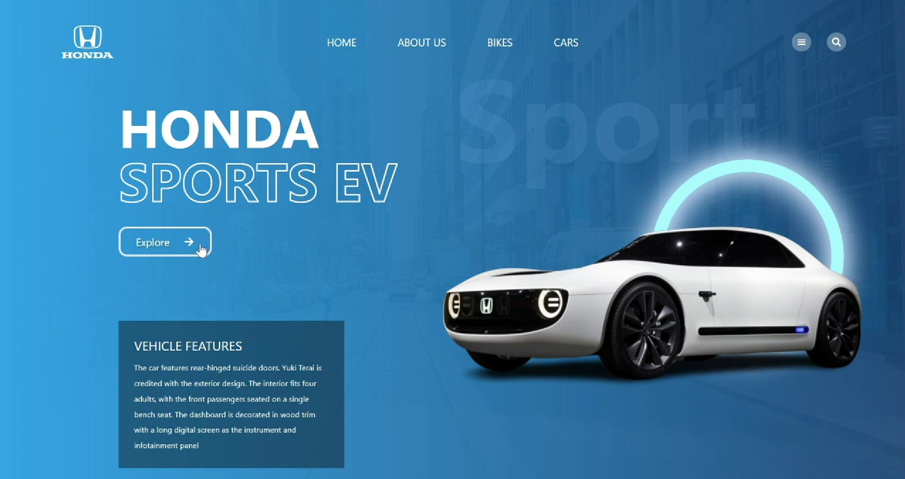

# 🚗 Modern Responsive Animated Car Website  
### Built with **React.js**, **Tailwind CSS**, and **Framer Motion**

A visually engaging, fully responsive, and animation-rich car showcase website designed with modern frontend technologies. This project highlights smooth motion effects, interactive UI elements, and a clean architectural structure — perfect for portfolios and real-world product websites.

---

## 📁 Project Structure
```
Modern-Responsive-Animated-Car-Website/
│── public/
│── src/
│   ├── components/
│   ├── sections/
│   ├── assets/
│   ├── App.jsx
│   ├── main.jsx
│── package.json
│── tailwind.config.js
│── README.md
```

---

## 🚀 Getting Started

### 1️⃣ Clone the repository
```bash
git clone https://github.com/your-username/Modern-Responsive-Animated-Car-Website.git
cd Modern-Responsive-Animated-Car-Website
```

### 2️⃣ Install dependencies
```bash
npm install
```

### 3️⃣ Run development server
```bash
npm run dev
```

### 4️⃣ Build production files
```bash
npm run build
```

---

## 🖼️ Preview




---

## 🧩 Components

| Component        | Description |
|------------------|-------------|
| **Navbar**       | Animated header with smooth transitions |
| **Hero Section** | Car intro with Framer Motion effects |
| **Showcase Cards** | Animated car feature grid |
| **Footer**       | Clean responsive footer |

---

## 📦 Deployment

### ✅ Vercel
```bash
vercel deploy
```

### ✅ Netlify  
Drag and drop the **dist** folder into Netlify dashboard.

### ✅ GitHub Pages
```bash
npm run build
git subtree push --prefix dist origin gh-pages
```

### ✅ AWS S3 + CloudFront  
1. Build project  
2. Upload **dist** folder to S3  
3. Enable static site hosting  
4. Connect CloudFront for CDN  

---

## 🤝 Contributing

Contributions and suggestions are welcome!  
Feel free to open an issue or a pull request.

---

## ⭐ Support

If this project helped you, please ⭐ star the repository!

---

## 📧 Contact

**Aarya Mahajan**  
Frontend Developer | React.js | Cloud | UI/UX  
📩 Contact me on GitHub or LinkedIn
